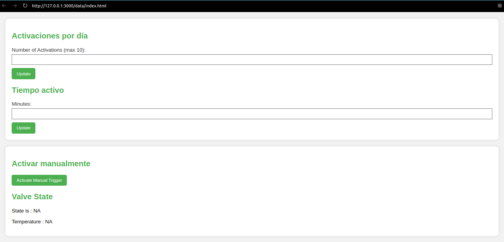

# Watering Automation System

A watering automation system built using ESP board and littlefs to serve a basic website on it. The system is designed for plants that need to be watered with a fiexed periodicity.

Further stages of the proyect will add more functionality.

Documentation will be added as the projects evolves and testing is made.

